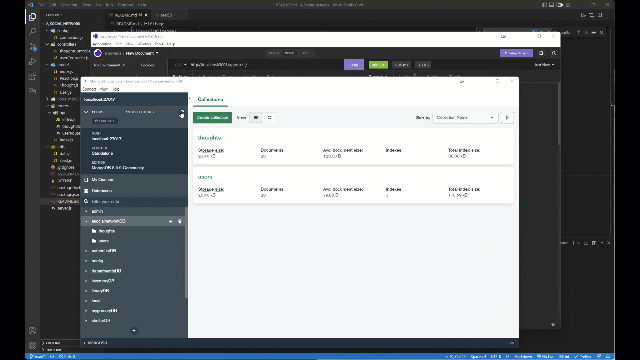

# A_Social_Network

## Description:

My Challenge this week is to build an API for a social network web application where users can share their thoughts, react to friends’ thoughts, and create a friend list. I will use Express.js for routing, a MongoDB database, and the Mongoose ODM.

There will be no front end, so this will need to be ran through node, and tested using insomnia.

## Table of Contents

- [Installation](#installation)
- [Usage](#usage)
- [Contribution](#contribution)
- [License](#license)
- [Git Info](#git-info)
- [Contact](#contact-me)

# Installation

Utilizes node and MySQL for database storage.
NPM packeges used:

- express: 4.18.1
- mongoose: 6.4.0

---

1. Clone repo
2. Run 'npm i'
3. Ensure you have a MongoDB database running.
4. Run node utils/seed.js
5. Test API using insomnia.

# Usage

[Video Walkthrough](https://drive.google.com/file/d/16vtG2LnEwR87zNjPP9ec5EMwNNyz_rbc/view?usp=sharing)

Once server is listening try different CRUD operations/Routes:

1. USERS

- Get all users http://localhost:3001/api/users
- Get user by ID http://localhost:3001/api/users/IDgoeshere
- Create a user http://localhost:3001/api/users/ (SEND JSON USERNAME AND EMAIL)
- Update a user http://localhost:3001/api/users/IDgoeshere (SEND JSON USERNAME AND EMAIL)
- Add a friend http://localhost:3001/api/users/IDGOESHERE/friends/OTHERIDGOESHERE
- Remove a friend http://localhost:3001/api/users/IDGOESHERE/friends/IDGOESHERE
- Delete a user http://localhost:3001/api/users/IDgoeshere

2. THOUGHTS

- Get all thoughts http://localhost:3001/api/thoughts
- Get thought by ID http://localhost:3001/api/thoughts/THOUGHTIDgoeshere
- Create a thought http://localhost:3001/api/thoughts/ (SEND JSON USERNAME AND THOUGHTTEXT)
- Update a thought http://localhost:3001/api/thoughts/THOUGHTIDgoeshere (SEND JSON USERNAME AND THOUGHTTEXT)
- Add a reaction http://localhost:3001/api/thoughts/THOUGHTIDHERE/reactions
- Remove a reaction http://localhost:3001/api/thoughts/THOUGHTIDHERE/reactions/ (SEND JSON REACTIONID)
- Delete a thought http://localhost:3001/api/thoughts/THOUGHTIDgoeshere

# Contribution

Open to any and all contributions!

# Git Info

Username: AuraFly
https://github.com/AuraFly

# Contact Me

[Contact Me](mailto:auraflydev@gmail.com)

# License

This application is covered under the MIT open source license.

Permission is hereby granted, free of charge, to any person obtaining a copy of this software and associated documentation files, to deal in the Software without restriction, including without limitation the rights to use, copy, modify, merge, publish, distribute, sublicense, and/or sell copies of the Software, and to permit persons to whom the Software is furnished to do so, subject to the following conditions:

The above copyright notice and this permission notice shall be included in all copies or substantial portions of the Software.

THE SOFTWARE IS PROVIDED 'AS IS', WITHOUT WARRANTY OF ANY KIND, EXPRESS OR IMPLIED, INCLUDING BUT NOT LIMITED TO THE WARRANTIES OF MERCHANTABILITY, FITNESS FOR A PARTICULAR PURPOSE AND NONINFRINGEMENT. IN NO EVENT SHALL THE AUTHORS OR COPYRIGHT HOLDERS BE LIABLE FOR ANY CLAIM, DAMAGES OR OTHER LIABILITY, WHETHER IN AN ACTION OF CONTRACT, TORT OR OTHERWISE, ARISING FROM, OUT OF OR IN CONNECTION WITH THE SOFTWARE OR THE USE OR OTHER DEALINGS IN THE SOFTWARE.
